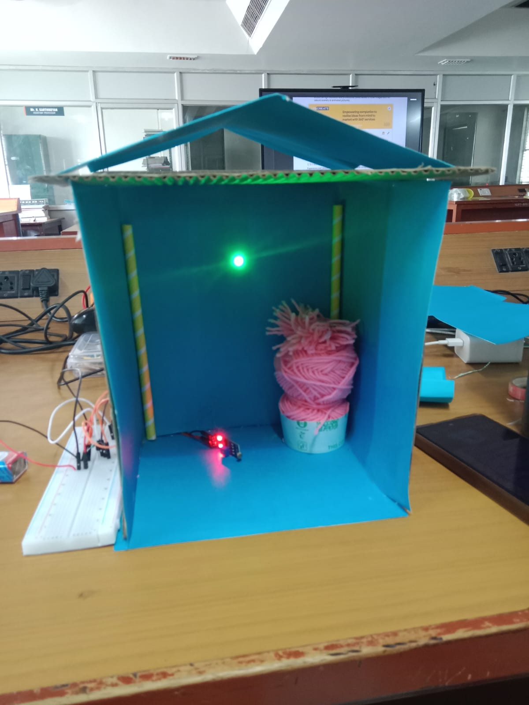

# LDR BASED HOME SECURITY LIGHTING SYSTEM

## AIM

To design and construct a light sensing home security system using a light dependent resistor(LDR),which automatically switches on an LED.when the surrounding light level drops,simulating an automatic security light that activates after dark.

## COMPONENTS REQUIRED

1. LDR  
2. sensor  
3. LED  
4. Breadboard  
5. Battery  
6. Jumper wires  
7. Model house

## PROCEDURE

1. Place the breadboard on a flat surface and mount the sensor/driver module on it.  
2. Connect the LDR to the input terminals of the sensor module.  
3. Connect the LED to the output terminal of the sensor module, observing correct polarity (anode to positive).  
4. Connect the battery's positive and negative terminals to the power rails of the breadboard to supply the circuit.  
5. Adjust the onboard potentiometer on the sensor module to set the light-threshold sensitivity.  
6. Mount the assembled circuit inside the model house, with the LDR positioned to sense the interior/ambient light and the LED positioned as the security light.  
7. Test the circuit by exposing the LDR to bright light and then covering it or dimming the surroundings, and note the LED's response.

## WORKING

The LDR is a light-sensitive resistor whose resistance decreases as light intensity increases and rises sharply in darkness. It forms part of a voltage-divider network on the sensor module, whose midpoint voltage is compared against a preset threshold by an onboard comparator. In bright conditions, the LDR's resistance is low, holding the comparator output — and hence the LED — OFF. When the light level falls, the LDR's resistance rises, the divider voltage crosses the threshold, and the comparator switches its output, turning the LED ON. This automatic ON/OFF behaviour is used to simulate a security light that activates at dusk or when an intruder blocks the ambient light source, making an unoccupied home appear active and deterring intrusion.

## OBSERVATION

The LDR-based home security circuit was successfully constructed and tested. The LED turned ON when the LDR was subjected to low light/darkness and remained OFF under bright light, confirming correct automatic operation of the light-sensing security system.

